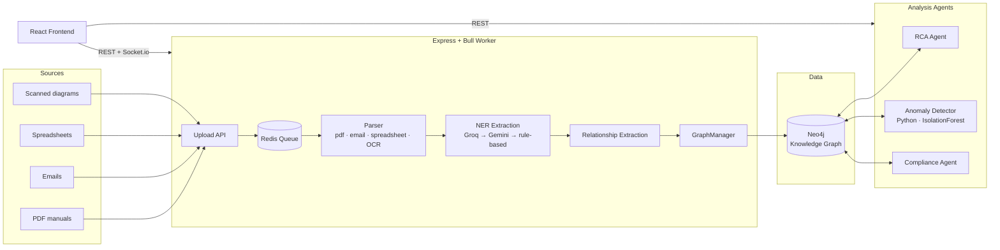

# Industrial Knowledge Intelligence (IKI)

**Turn scattered maintenance paperwork into a living knowledge graph — then use it to find root causes, catch failures before they happen, and answer "why did this break?" in seconds instead of days.**

[](LICENSE)
[](backend/package.json)
[](frontend/package.json)
[](docker-compose.yml)

---

## The problem

Industrial plants generate an enormous, disconnected paper trail: PDF manuals, inspection reports, maintenance emails, spreadsheets, hand-annotated P&ID diagrams. When a pump fails at 2 a.m., the answer to "has this happened before, and why?" is usually buried across a dozen file formats nobody has time to cross-reference.

**IKI ingests that paper trail automatically**, extracts equipment, incidents, procedures, and parameters into a Neo4j knowledge graph, and layers three intelligence tools on top of it: root cause analysis, anomaly detection, and graph exploration — so the answer takes seconds, not a search through shared drives.

## What it does

| | |
|---|---|
| 📥 **Multi-format ingestion** | PDF, email (`.eml`/`.msg`), spreadsheets, and scanned diagrams (OCR) — parsed, entity-extracted, and written into the graph automatically, with live progress over Socket.io. |
| 🧠 **AI-driven RCA** | Describe a symptom in plain English → get ranked probable causes, diagnostic steps, and preventive measures, cross-referenced against the equipment's real incident history. |
| 🕸️ **Knowledge graph visualization** | Interactive D3 force-directed graph of any equipment's 2-hop neighborhood — incidents, procedures, parameters, documents — not just a list, a map. |
| 🚨 **Anomaly detection** | Isolation Forest (scikit-learn) over each asset's maintenance history flags frequent failures, extended repairs, cost outliers, and cascading failures, with a plain-language recommendation for each. |
| ✉️ **Email thread timelines** | Reconstructs an incident's email correspondence in chronological order, linked back to the incident it resolved. |
| 📋 **Equipment history** | Every asset's failures, procedures, and parameter readings on one timeline. |
| ✅ **Compliance auditing** | Backend agent that checks the graph against regulatory requirements and can alert on high-severity gaps (API-level; not yet wired to a dedicated page). |

## How it fits together



The frontend never talks to Neo4j directly — everything goes through the Express API, which is also the only thing that knows whether an LLM key is configured. If Groq/Gemini calls fail or aren't configured, RCA and NER both degrade gracefully to heuristic/rule-based logic rather than failing outright.

## Tech stack

| Layer | Choice |
|---|---|
| Frontend | React 19, React Router v7, TanStack Query v5, Zustand, Tailwind CSS v4, D3, Socket.io-client |
| Backend | Node.js, Express 5, Bull (Redis-backed job queue), Socket.io |
| Data | Neo4j 5 (knowledge graph), Redis 7 (queue) |
| AI / ML | Groq (Llama 3.3 70B) primary, Gemini fallback, rule-based fallback beneath that; Python 3 + scikit-learn IsolationForest for anomaly detection |
| Parsing | `pdf-parse`, `mailparser`, spreadsheet + OCR (`tesseract.js`) pipelines |

## Quick start

```bash
# 1. Infra — Neo4j + Redis
docker-compose up -d

# 2. Backend
cd backend
npm install
echo "GROQ_API_KEY=your_key_here" >> .env   # optional — falls back to heuristics without it
npm run dev

# 3. Frontend — real mode (talks to the backend above)
cd frontend
npm install
echo "VITE_API_URL=http://localhost:3001/api" >> .env.local
npm run dev
```

Open `http://localhost:5173`. Leaving `VITE_API_URL` unset runs the entire frontend against realistic mock data — no backend, Neo4j, or API keys required, useful for UI iteration.

**Seed sample data** (extracts a sample incident report straight into the graph via the real NER pipeline):

```bash
cd backend && node scripts/seed-db.js
```

## API reference

| Method | Endpoint | Purpose |
|---|---|---|
| `POST` | `/api/documents/upload` | Upload a document (`document` field), queues ingestion |
| `GET` | `/api/documents/status/:jobId` | Poll ingestion progress (0–100%) |
| `GET` | `/api/documents` | List all ingested documents |
| `GET` | `/api/equipment` | List equipment, optional `?type=` filter |
| `GET` | `/api/equipment/:id/history` | Failures, procedures, parameters for one asset |
| `GET` | `/api/graph/equipment/:id/visualization` | D3-ready subgraph around one equipment node |
| `GET` | `/api/graph/snapshot` | Full graph snapshot |
| `POST` | `/api/rca/analyze` | Root cause analysis for a symptom description |
| `GET` | `/api/anomalies` | Anomaly scan across all equipment |
| `GET` | `/api/anomalies/:equipmentId` | Anomaly scan for one asset |
| `GET` | `/api/emails/thread/:threadId` | Email correspondence for an incident thread |
| `GET` | `/api/compliance/check` | Run a compliance audit |
| `GET` | `/api/health` | Service + Neo4j connectivity check |

Real-time: the frontend also listens for `ingestion:progress`, `ingestion:complete`, and `ingestion:failed` over Socket.io, with polling as an automatic fallback if the socket connection drops.

## Project structure

```
backend/
  src/
    agents/         RCA, compliance, and query agents (LLM + heuristic fallback)
    analytics/       Isolation Forest anomaly detection
    extraction/      NER + relationship extraction
    graph/           Neo4j GraphManager + reusable query helpers
    ingestion/       Per-format document parsers (PDF, email, spreadsheet, diagram/OCR)
    workers/         Bull ingestion worker + Socket.io progress events
    api/routes.js    All REST endpoints
  scripts/           Seed data, init-db, and E2E pipeline test scripts

frontend/
  src/
    pages/           Dashboard, Ingestion, Equipment, RCA, Knowledge Graph, Anomalies, Email Threads
    hooks/queries.js TanStack Query hooks (server state)
    stores/uiStore.js Zustand store (client/UI state)
    api/             Real API client + mock-mode data (auto-switches on VITE_API_URL)
```

## License

Apache 2.0 — see [LICENSE](LICENSE).
